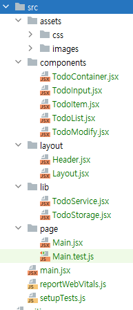
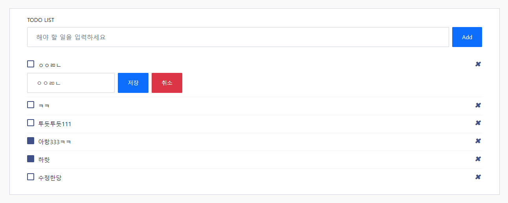

# STATE만으로 구현해본 TODO-LIST

## 배울 수 있었던것

- 컴포넌트는 작은 컴포넌트부터 아래에서 위로 구현하는 것이 좋다.
- props와 handler function은 고민해보고 작성한다.
- custom hook을 이용하면 비지니스로직을 효율적으로 추상화 할 수 있다.

## 작성한 소스와 화면

### 폴더구조



### 화면



### 소스코드

```jsx
export const TodoService = (todoList) => {
    return {
        add: (todo) => {
            const addTodo = {id: uuid(), checked: false, editState: false, ...todo};

            return [...todoList, addTodo];
        },
        remove: (todo) => {
            todoList.splice(todoList.indexOf(todo), 1);
            return [...todoList];
        },
        update: (old, newTodo) => {
            const result = [...todoList];
            result.splice(result.indexOf(old), 1, {...old, ...newTodo});
            return result;
        }
    }
}

export const useTodoList = (initial) => {
    const initList = [...todoStorage.getList(), ...initial];
    const [todoList, setTodoList] = useState(initList);
    const todoService = TodoService(todoList);

    useEffect(() => {
        todoStorage.save(todoList);
    }, [todoList]);

    const add = (todo) => setTodoList(todoService.add(todo));
    const remove = (todo) => setTodoList(todoService.remove(todo));
    const update = (old, newTodo) => setTodoList(todoService.update(old, newTodo));

    return {
        add,
        remove,
        update,
        items: todoList
    }
}
```

```jsx
export const TodoContainer = () => {
    const todoList = useTodoService([]);

    const onSubmitInput = (todo) => todoList.add(todo);
    const onClickRemove = (todo) => todoList.remove(todo);
    const onChangeCheck = (todo, checked) => todoList.update(todo, {checked});
    const onSubmitModify = (todo, message) => todoList.update(todo, {message});

    const todoInputProps = {
        onSubmitInput
    };

    const todoListProps = {
        todoList: todoList.items,
        onClickRemove,
        onChangeCheck,
        onSubmitModify
    }

    return (
        <>
            <TodoInput {...todoInputProps}/>
            <TodoList {...todoListProps}/>
        </>
    );
}
```

```jsx
export const TodoInput = ({onSubmitInput}) => {
    const [inputText, setInputText] = useState('');

    const inputRef = createRef();
    const $inputElement = () => inputRef.current;

    useEffect(() => {
        $inputElement().focus();
    }, []);

    useEffect(() => {
        $inputElement().value = inputText;
    }, [inputText]);

    const handleSubmitInput = event => {
        event.preventDefault();

        if (!inputText) {
            $inputElement().focus();
            return alert('할일을 입력하세요');
        }

        onSubmitInput({message: inputText});

        setInputText('');
    }

    const onChange = ({target: {value}}) => {
        setInputText(value);
    }

    return (
        <form className="add-items d-flex" onSubmit={handleSubmitInput}>
            <input type="text"
                   ref={inputRef}
                   id="input"
                   className="form-control todo-list-input"
                   placeholder="해야 할 일을 입력하세요"
                   onChange={onChange}
                   role="todoInput"/>

            <button className="add btn btn-primary font-weight-bold"
                    role="addTodoButton">
                Add
            </button>
        </form>
    );
}
```
```jsx
export const TodoItem = ({text, check = false, onChangeCheck, onSubmitModify, onClickRemove}) => {
    const [checked, setChecked] = useState(check);

    const handleChangeCheck = ({target: {checked}}) => {
        setChecked(checked);
        onChangeCheck(checked);
    }
    const handleClickRemove = () => onClickRemove();
    const handleSubmitModify = text => onSubmitModify(text);

    return (
        <>
            <div className="form-check">
                <label className="form-check-label">
                    <input className="checkbox"
                           type="checkbox"
                           checked={checked}
                           onChange={handleChangeCheck}
                           role="todoChecked"/>
                    <i className="input-helper"/>
                </label>

                <TodoModify text={text} onSubmitModify={handleSubmitModify}/>
            </div>

            <i className="remove mdi mdi-close-circle-outline"
               onClick={handleClickRemove}
               role="removeTodo"/>
        </>
    )
}
```
```jsx
export const TodoList = ({todoList, onClickRemove, onChangeCheck, onSubmitModify}) => {
    const handleChangeCheck = (todo) => {
        return checked => {
            onChangeCheck(todo, checked);
        };
    }

    const handleClickRemove = (todo) => {
        return () => {
            onClickRemove(todo);
        };
    }

    const handleSubmitModify = (todo) => {
        return text => {
            if (!text) return alert('할 일을 입력하세요');

            onSubmitModify(todo, text);
        };
    }

    return (
        <div className="list-wrapper">
            <ul className="d-flex flex-column-reverse todo-list" role="todoList">
                {todoList.map(todo =>
                    <li role="todoListItem" key={todo.id}>
                        <TodoItem
                            text={todo.message}
                            check={todo.checked}
                            onSubmitModify={handleSubmitModify(todo)}
                            onChangeCheck={handleChangeCheck(todo)}
                            onClickRemove={handleClickRemove(todo)}
                        />
                    </li>
                )}
            </ul>
        </div>
    );
}
```
```jsx
export const TodoModify = ({text, onSubmitModify}) => {
    const [modifyAble, setModifyAble] = useState(false);
    const [modifyInput, setModifyInput] = useState('');

    const toggleModifyAble = () => {
        setModifyInput(text);
        setModifyAble(!modifyAble);
    }

    const onChangeModifyInput = ({target: {value}}) => {
        setModifyInput(value);
    }

    const handleSubmitModify = e => {
        e.preventDefault();

        onSubmitModify(modifyInput);

        setModifyAble(false);
    }

    if (!modifyAble) {
        return <span onClick={toggleModifyAble}>{text}</span>;
    }

    return (
        <>
            <span>{modifyInput}</span>

            <form onSubmit={handleSubmitModify}
                  className="d-flex gap-2 mt-2">

                <input type="text"
                       onChange={onChangeModifyInput}
                       value={modifyInput}
                       className="form-control"/>

                <button className="btn btn-sm btn-primary">저장</button>

                <button type="button"
                        className="btn btn-sm btn-danger"
                        onClick={toggleModifyAble}>
                    취소
                </button>
            </form>
        </>
    );
}
```

## 작성 과정

### 요약

1. 최초엔 TodoList.jsx TodoInput.jsx 두개의 컴포넌트로 나누어 진행 했다.
2. 만들고 리팩토링 하고 보니 가장 실수한 부분은 TodoList.jsx 에서 코드 작성을 시작한 것이다(이유는 뒤에 적음)

```jsx
import {useState} from "react";

export const TodoList = ({todoList, removeTodo, changeCheckedTodo, saveTodo}) => {
    const [inputTodo, setInputTodo] = useState();
    const [editState, setEditState] = useState({});

    const handleCheckChanged = (todo) => {
        return e => {
            changeCheckedTodo(todo, e.target.checked);
        };
    }

    const handleRemoveButtonClicked = (todo) => {
        return () => {
            removeTodo(todo);
        };
    }

    const handleModifyTodo = (todo) => {
        return e => {
            e.preventDefault();

            Object.keys(editState).filter(key => key !== todo.id).forEach(key => editState[key] = false);
            editState[todo.id] = !editState[todo.id];
            setInputTodo(todo.message);
            setEditState({...editState});
        };
    }

    const handleModifySaveTodo = (todo) => {
        return e => {
            e.preventDefault();

            if (!inputTodo) {
                return alert('할 일을 입력하세요');
            }

            Object.keys(editState).forEach(key => editState[key] = false);
            setEditState({...editState});
            saveTodo(todo, inputTodo);
        };
    }

    const onChange = e => {
        setInputTodo(e.target.value);
    }

    return (
        <div className="list-wrapper">
            <ul className="d-flex flex-column-reverse todo-list" role="todoList">
                {todoList.map(todo =>
                    <li key={todo.id} role="todoListItem">
                        <div className="form-check">
                            <label className="form-check-label">
                                <input className="checkbox"
                                       type="checkbox"
                                       checked={todo.checked}
                                       onChange={handleCheckChanged(todo)}
                                       role="todoChecked"/>
                                <i className="input-helper"/>
                            </label>
                            {editState[todo.id] ?
                                <form onSubmit={handleModifySaveTodo(todo)} style={{display: "inline-block"}}>
                                    <input type="text"
                                           onChange={onChange}
                                           value={inputTodo}/>
                                    <button>save</button>
                                    <button type="button" onClick={handleModifyTodo(todo)}>cancel</button>
                                </form> :
                                <span onClick={handleModifyTodo(todo)}>{!editState[todo.id] && todo.message}</span>}
                        </div>

                        <i className="remove mdi mdi-close-circle-outline"
                           onClick={handleRemoveButtonClicked(todo)}
                           role="removeTodo"/>
                    </li>
                )}
            </ul>
        </div>);
}
```

```js
export const TodoInput = ({addTodo}) => {
    const [input, setInput] = useState('');

    const $input = createRef();

    useEffect(() => {
        $input.current.focus();
    }, []);

    const addInput = event => {
        event.preventDefault();

        if (!input) {
            $input.current.focus();
            return alert('할일을 입력하세요');
        }

        addTodo({id: uuid(), message: input, checked: false, editState: false});

        setInput('');
        $input.current.value = '';
    }

    const onChange = e => {
        setInput(e.target.value);
    }

    return (
        <form className="add-items d-flex" onSubmit={addInput}>
            <input type="text"
                   ref={$input}
                   id="input"
                   className="form-control todo-list-input"
                   placeholder="해야 할 일을 입력하세요"
                   onChange={onChange}
                   role="todoInput"/>

            <button className="add btn btn-primary font-weight-bold"
                    role="addTodoButton">
                Add
            </button>
        </form>
    );
}
```

> TodoService와 TodoStorage에는 CRUD 비지니스로직이 들어있음

제대로 작성했는지 모르겠지만 대충 기능 동작은 되도록 작성 했다. 

- ADD,REMOVE 가 동작한다.
- 체크가 정상 동작한다.
- 수정 기능이 정상 동작한다.
- LOCALSTORAGE에 저장이 된다.

## 리팩토링

컴포넌트가 너무 크고 로직 흐름을 따라 가기 어려워서 컴포넌트를 좀더 작게 쪼개 보기로 하고 나누기 시작했다.
그냥 html을 옮기고 props로 모두 내려 보니 다음과 같이 되었다.

```jsx
export const TodoItem = ({
                             todo,
                             handleCheckChanged,
                             handleModifySaveTodo,
                             handleModifyTodo,
                             handleRemoveButtonClicked,
                             input,
                             inputEdit,
                             onChange
                         }) => {

    return (
        <li role="todoListItem">
            <div className="form-check">
                <label className="form-check-label">
                    <input className="checkbox"
                           type="checkbox"
                           checked={todo.checked}
                           onChange={handleCheckChanged(todo)}
                           role="todoChecked"/>
                    <i className="input-helper"/>
                </label>

                <TodoModify {...{
                    todo,
                    handleModifySaveTodo,
                    handleModifyTodo,
                    onChange,
                    input,
                    inputEdit
                }}/>

            </div>

            <i className="remove mdi mdi-close-circle-outline"
               onClick={handleRemoveButtonClicked(todo)}
               role="removeTodo"/>
        </li>)
}
```
```jsx
export const TodoModify = ({
                               todo,
                               handleModifySaveTodo,
                               handleModifyTodo,
                               onChange,
                               input,
                               inputEdit
                           }) => {
    const {message, id} = todo;

    if (!inputEdit[id]) {
        return (<span onClick={handleModifyTodo(todo)}>{!inputEdit[todo.id] && todo.message}</span>);
    }

    return (
        <>
            <span>{message}</span>

            <form onSubmit={handleModifySaveTodo(todo)}
                  className="d-flex gap-2 mt-2">

                <input type="text"
                       onChange={onChange}
                       value={input}
                       className="form-control"/>

                <button className="btn btn-sm btn-primary">저장</button>

                <button type="button"
                        className="btn btn-sm btn-danger"
                        onClick={handleModifyTodo(todo)}>
                    취소
                </button>
            </form>
        </>
    );
}

```
```jsx
export const TodoContainer = ({todoStorage}) => {
    const [todoList, setTodoList] = useState(todoStorage.getList());

    const todoService = TodoService(todoList);

    useEffect(() => {
        todoStorage.save(todoList);
    }, [todoList]);

    const addTodo = (todo) =>
        setTodoList(todoService.add(todo));

    const removeTodo = (todo) =>
        setTodoList(todoService.remove(todo));

    const changeCheckedTodo = (todo, checked) =>
        setTodoList(todoService.update(todo, {checked}));

    const saveTodo = (todo, message) =>
        setTodoList(todoService.update(todo, {message}));

    const todoInputProps = {addTodo};
    const todoListProps = {todoList, removeTodo, changeCheckedTodo, saveTodo}

    return (
        <>
            <TodoInput {...todoInputProps}/>
            <TodoList {...todoListProps}/>
        </>
    );
}
```

> 나누고 나니 뭔가 잘못되었음을 느낌.

컴포넌트를 조금 더 나누고 나니 코드가 더 보기 흉해짐. 차라리 나누기 전이 더 나았다. 
어떻게 해야 하나 고민 하다 코드의 일부분만 고쳐 나가면서 수정하다간 머리털이 다 뽑힐 것 같아 컴포넌트를 차라리 다시 만드는 쪽으로 생각을 바꿨다.

왜 이렇게 되었나 생각해보니 다음과 같은 문제가 있었다고 생각해 볼 수 있었다.

- 위에서부터 시작하여 아래쪽 컴포넌트를 만들어 나가다보니 아래쪽으로 그냥 아무런 생각없이 일단 props로 todo객체를 내리고 있었다
- todoList 객체 자체를 내리고 TodoList 컴포넌트에 의존하다보니 모든 로직이 TodoList에 집중될 수 밖에 없고 분리된 컴포넌트는 TodoList없이 아무것도 할 수 없는 상태가 되었다
- 그래서 아래쪽 컴포넌트부터 다른 컴포넌트 없이 혼자서도 동작할 수 있도록 작성해 나가기 시작했다.

TodoItem.jsx를 먼저 바꿨다.

```jsx
export const TodoItem = ({text, check = false, onChangeCheck, onSubmitModify, onClickRemove}) => {
    const [checked, setChecked] = useState(check);

    const handleChangeCheck = ({target: {checked}}) => {
        setChecked(checked);
        onChangeCheck(checked);
    }
    const handleClickRemove = () => onClickRemove();
    const handleSubmitModify = text => onSubmitModify(text);

   //아래로직 생략
}
```

text와 check props만 받아서 혼자서도 동작 할 수 있도록 만들어 나가니 다음과 같이 혼자서 동작 가능한지 확인해볼수 있는 코드 작성이 가능했다.

```jsx
<TodoItem text="test" 
          onChangeCheck={console.log(1)} 
          onSubmitModify={console.log(1)} 
          onClickRemove={console.log(1)}/>
```

그 다음은 다음과 같은 순서로 진행했다.

> TodoModify.jsx -> TodoList.jsx -> TodoInput.jsx -> TodoContainer.jsx 

아래에서 위로 올라가니 자연스럽게 쓸모없는 코드는 줄어들고 좀더 깔끔하게 코드를 작성해 나갈 수 있었다.

그리고 TodoService를 useTodoList라는 customHook으로 만들어서 사용해 보니 조금 더 코드도 일기 쉬워지고 재사용성도 증가되는걸 알 수 있었다.
